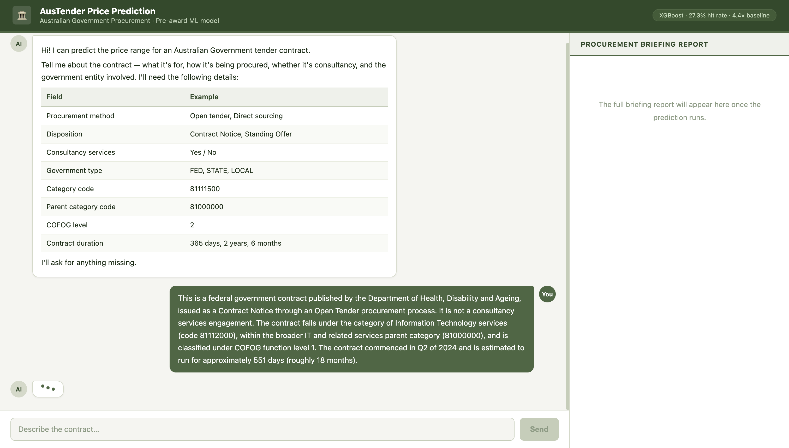
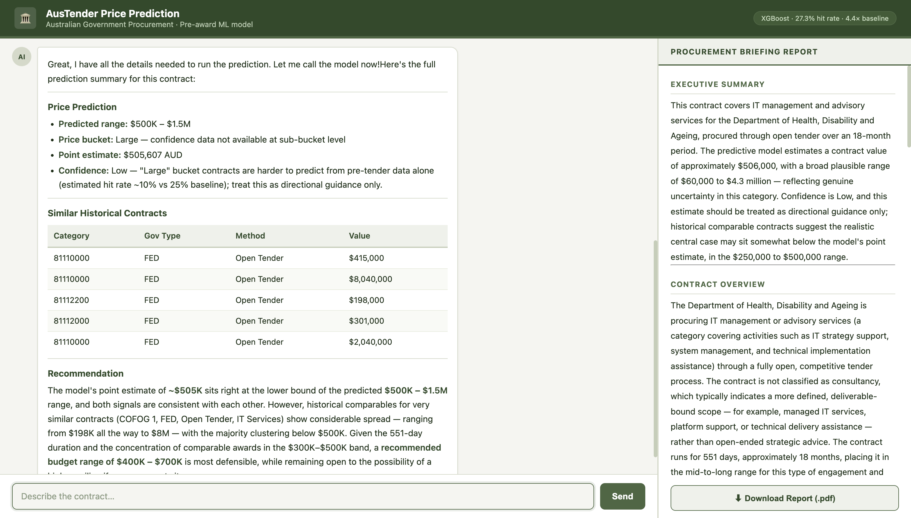
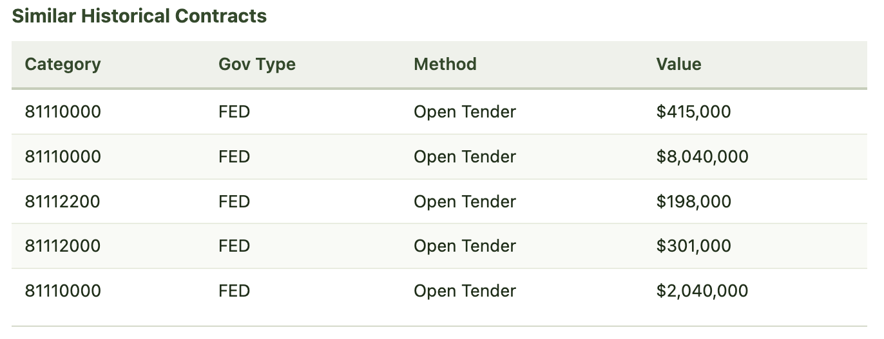
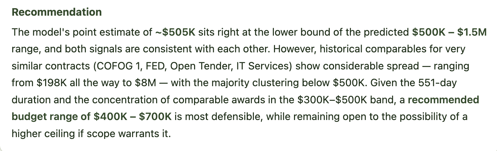

# Tender Price Prediction — Multi-Agent System

A multi-agent ML pipeline that predicts Australian Government contract prices from pre-award tender information only.

---

## Demo

### Conversational Interface
The agent collects contract details through natural language dialogue — no forms to fill in. It asks for missing fields one at a time and confirms what it has before running the prediction.



*The assistant extracts contract fields from free-text input and asks only for what it's missing. Once enough information is collected it automatically triggers the ML pipeline.*

---

### Price Prediction Report
After collecting the contract details, the agent runs the ML pipeline and generates a full procurement briefing report in the right panel.



*The report includes a point estimate, 90% confidence interval, price band (Small/Medium/Large/Very Large), sub-range, and a confidence assessment. All dollar amounts are derived from the XGBoost regression model trained on 1M+ historical AusTender contracts.*

---

### Similar Historical Contracts
The report surfaces the most similar historical contracts from the RAG index to give procurement officers real-world anchors.



*ChromaDB vector search retrieves the 5 most similar past contracts by procurement characteristics. These are used as supporting evidence — the ML point estimate remains the primary recommendation anchor.*

---

### Recommendation
The report closes with a plain-language recommended dollar range for budget planning and market engagement.



*The recommendation anchors to the ML point estimate by default. It only adjusts if the majority of similar historical contracts consistently suggest a different range.*

---

## Architecture

```
User (chat)
    │
    ▼
FastAPI + Anthropic Claude (conversational field collection)
    │
    ▼
ML Runner (subprocess)
    ├── DataProcessor     — cleans & encodes contract features
    ├── XGBoost Regressor — point estimate + 90% CI
    ├── predict_from_regression() — deterministic bucket/sub-range
    └── Validator         — confidence scoring + warnings
    │
    ▼
LangGraph Pipeline
    ├── ml_critique node  — plausibility assessment of ML outputs
    ├── analysis node     — RAG search + similar contract interpretation
    └── reporting node    — full procurement briefing report synthesis
```

---

## Quick Start

### 1. Install dependencies
```bash
pip install -r requirements.txt
```

### 2. Train (runs once — saves models to ./models/)
```bash
python orchestrator.py --mode train --data tenders_export.xlsx
```

### 3. Index tenders into RAG
```bash
python run_agent.py index --data tenders_export.xlsx
```

### 4. Run the web app
```bash
python app.py
```

### 5. Predict via CLI
```bash
python run_agent.py predict \
  --procurement-method "open tender" \
  --disposition "contract notice" \
  --is-consultancy-services "no" \
  --publisher-gov-type "FED" \
  --category-code "81111500" \
  --parent-category-code "81000000" \
  --publisher-cofog-level "2" \
  --publisher-name "Department of Defence" \
  --duration-days 365
```

### 6. Evaluate on the dataset
```bash
python orchestrator.py --mode evaluate --data tenders_export.xlsx
```

---

## Pre-award features used

| Feature | Description |
|---|---|
| `procurement_method` | Open tender, direct sourcing, select tender, etc. |
| `disposition` | Contract notice, standing offer notice, amendment |
| `is_consultancy_services` | Yes / No |
| `publisher_gov_type` | FED / STATE / LOCAL |
| `category_code` | 8-digit UNSPSC commodity code |
| `parent_category_code` | Top-level UNSPSC category |
| `publisher_cofog_level` | Government functional classification level |
| `publisher_name` | Publishing agency name (auto-derives portfolio and COFOG) |
| `publisher_portfolio` | Agency portfolio (auto-derived from publisher_name lookup) |
| `duration_days` | Intended contract duration from procurement plan |
| `contract_start_year` | Year of contract start (captures inflation trends) |
| `contract_start_quarter` | Quarter of contract start (captures budget cycle patterns) |

---

## Model Performance

| Change | R² |
|---|---|
| Baseline (7 features, OHE) | 0.38 |
| + duration_days | 0.52 |
| + publisher_name, native categoricals | 0.59 |
| + contract_start_year / quarter | 0.607 |

- **Training rows:** ~1M AusTender contracts
- **Encoding:** XGBoost native categoricals (no one-hot encoding)
- **Sub-range hit rate:** 16% vs 6.25% random baseline
- **Bucket assignment:** Deterministic from regression point estimate

See [MODEL_CHANGES.md](MODEL_CHANGES.md) for a full history of architectural decisions.
