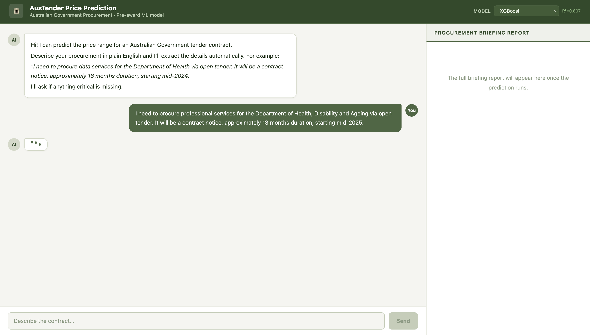
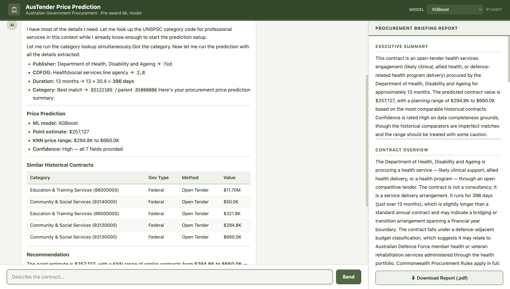

# Tender Price Prediction Agent

A conversational ML agent that predicts Australian Government contract prices from pre-award tender information only.

---

## How It Works

### 1. Describe your procurement in plain English
Type a natural language description of what you're procuring — no forms, no codes.



*Example: "I need to procure data services for the Department of Health via open tender. It will be a contract notice, approximately 18 months duration, starting mid-2024."*

The agent automatically extracts all required fields from your description. It uses a domain RAG (UNSPSC codes, COFOG levels, AusTender valid values) to resolve commodity codes and agency details — you never need to look these up manually.

---

### 2. Receive a full procurement briefing report
The agent runs the ML pipeline and generates a structured report in the right panel.



The report includes:
- **Point estimate** — ML regression prediction (XGBoost trained on 1M+ AusTender contracts)
- **KNN price range** — outlier-filtered min/max from the most similar historical contracts
- **Plausibility assessment** — whether the estimate makes sense for this contract type
- **Confidence level** — based on how many of the 7 fields were known
- **Similar historical contracts** — up to 5 past contracts with comparable characteristics
- **Recommendation** — plain-language planning range for budget and market engagement

---

## Architecture

```
User (natural language description)
        │
        ▼
Claude (conversational agent)
  ├── lookup_procurement_codes  — resolves UNSPSC codes via domain RAG
  └── predict_contract          — triggers ML pipeline when fields collected
        │
        ├── ML Runner (subprocess)
        │     ├── DataProcessor   — cleans & encodes contract features
        │     ├── Regressor       — point estimate (XGBoost / LightGBM / CatBoost etc.)
        │     └── Validator       — field completeness + confidence scoring
        │
        └── LangGraph Pipeline
              ├── analysis node   — KNN search + similar contract interpretation
              └── reporting node  — plausibility assessment + full briefing report
```

---

## Quick Start

### 1. Install dependencies
```bash
pip install -r requirements.txt
```

### 2. Train models
```bash
python train_models.py --data tenders_export.xlsx
```

### 3. Build domain RAG index
```bash
python rag/domain_indexer.py
```

### 4. Run the web app
```bash
python app.py
```

Open [http://localhost:8000](http://localhost:8000)

---

## Pre-award Features

| Feature | Description |
|---|---|
| `procurement_method` | Open tender, direct sourcing, select tender, etc. |
| `disposition` | Contract notice, standing offer notice |
| `publisher_gov_type` | fed / qld / nsw / vic / wa / act / sa / tas / nt |
| `category_code` | 8-digit UNSPSC commodity code |
| `parent_category_code` | UNSPSC segment (auto-derived) |
| `publisher_cofog_level` | Government functional classification |
| `publisher_name` | Publishing agency name |
| `duration_days` | Intended contract duration in days |

---

## Model Performance

| Model | R² | MAE (log) |
|---|---|---|
| XGBoost | 0.61 | — |
| LightGBM | — | — |
| CatBoost | — | — |

- **Training data:** ~1M AusTender contracts
- **Multiple models supported** — switch active model via the UI dropdown

See [MODEL_CHANGES.md](MODEL_CHANGES.md) for full architecture history.
